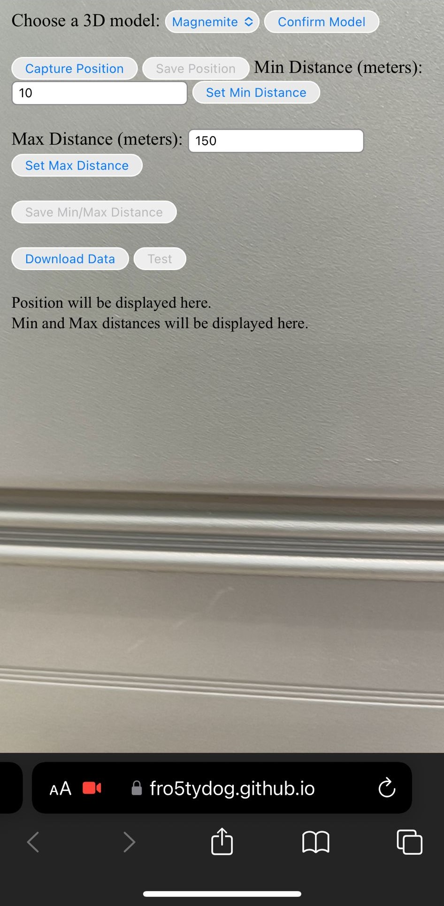

# Location-Based-Specifier

This is a web application that allows you to specify the location of your location-based AR models for the application, [LTA Web Solutions](https://github.com/Fro5tyDog/ConfigWebAR)

Do check out the official [documentation](https://docs.google.com/document/d/19cwEUnHil9duK8Ft2e--_a93_jggtFodaKbC-ouOoWY/edit?usp=sharing) for LTA Web Solutions

## Why Create This?

Working to gather the configuration details for the LTA Web Solutions application involved stpes that were unreliable and inaccurate, in particular, the location data. The application requies you to specify your latitude and longitude and applications like google map fail to be precise to your exact location. Thus, this application was built to allow you to utilise the latitude and longitude of your phone and specify the 3D models you need. 

__Can I use Google Maps to get location data?__<br>
Yes you can, but I recommend you to not use it as it would be almost impossible to pin point locations, especially at areas with a significant amount of shelter. Moreover, this application will let you try the settings you specified on the spot so you need not have to constantly update your source code at the venue itself.

## Installation (OPTIONAL)

Download the files by [forking](https://docs.github.com/en/pull-requests/collaborating-with-pull-requests/working-with-forks/fork-a-repo) the repository and using [github desktop](https://github.com/apps/desktop). 

If you wish to run the application on a local host, you may use [git clone](https://github.com/git-guides/git-clone) or download the zipped version of the repository. _Note that if your are using local host, you will need a HTTPS connection to utilise Aframe_

```bash
git clone https://github.com/Fro5tyDog/location-based-specifier.git
```

After cloning the repository, you want to run it in github Pages. Follow [this](https://docs.github.com/en/pages/quickstart) for a quick guide on how to do this.

## How to Use

This is simplified set of instructions that will be able to get you started. However, if you wish to read more about this, I have a [documentation] regarding this entire application. 

__Step 1:__
Add any additional assets to the asset folder. _Note that all models must be in gltf_

__Step 2:__
Go to the javascript and find the function _staticLoadPlaces()_, ammend the total number of objects, and their information, based on your models in the assets folder. When you are done, commit the changes to your github and check actions to view your pages being updated.

_If you are having trouble figuring out what to put for the latitude and longitude, go to google maps and copy the latitude and longitude of your current location. This will let you view the 3D models in front of you to verify that they work_

```js
function staticLoadPlaces() {
    console.log('Loading static places...');
    return [
        {
            name: 'Magnemite',
            filePath: './assets/magnemite/scene.gltf',
            location: { 
                lat: 1.3087085765187283,
                lng: 103.85002403454892,
            },
            visibilityRange: { min: 0, max: 100 }, // Appear when within 10-100m
        },
        {
            name: 'Dragonite',
            filePath: './assets/dragonite/scene.gltf',
            location: { 
                lat: 1.306656407996899,
                lng: 103.85012141436107,
            },
            visibilityRange: { min: 10, max: 150 }, // Custom distance range
        },
    ];
}
```
__Step 3:__
Open your github Pages link on a __MOBILE__ device. It should look something like this: https://_your-github-username_.github.io/location-based-specifier/

<br>

Below is a table regarding all of the buttons and their functionality. _If you have still having issues with understanding, consult the official documentation for more information._

| Name | Description | Condition to be used |
| --- | --- | --- |
| Magnemite | A drop down of all your models. | Always Open |
| Confirm Model | Specifies the model you want to make  | Always Open |
| Capture Position | Captures the current logititude and latitude of your phone | Always Open |
| Save Position | Saves your position captured with the "Capture Position" button| Only active once a position is captured. |
| 10 | The minimum distance which the model will be visible (Default value: 10m) | Always Open |
| Set Min Distance | Confirms the number set in "minimum distance" | Always Open |
| 150 | The maximum distance which the model will be visible (Default value: 150m) | Always Open |
| Set Max Distance | Confirms the number set in "maximum distance" | Always Open |
| Save Min/Max Distance | Saves the distance values you set | Only active once a ONE distance is specified |
| Download Data | Download your json file with the settings for your 3D models. | Always Open |
| Test | Allows the user to verify his changes | Open once the "Save Position" and "Save Min/Max Distance" has been set for all models. |

## Contributing

Pull requests are welcome. For major changes, please open an issue first
to discuss what you would like to change.

Please make sure to update tests as appropriate.

**Current Contributors**
| Name | Description |
| --- | --- |
| Ignatius | Intern from Republic Poly (18 March 2024 - 17 Jan 2025) |


## Programming Languges and Third-Party Software

_Do familiarise yourself with the following languges and third-party software before attempting to develop on this project._

- **languages**
  - [html](https://www.w3schools.com/html/)
  - [css](https://www.w3schools.com/css/)
  - [javascript](https://www.w3schools.com/js/)
  - [json](https://www.w3schools.com/js/js_json_intro.asp)<br><br>

- **Third-Party Software**
  - [AFrame](https://aframe.io/docs/1.6.0/introduction/)
  - [MindAR](https://hiukim.github.io/mind-ar-js-doc/)
  - [Model Viewer](https://modelviewer.dev/)


## Helpful Links

[DOM Render Not Showing Up](https://stackoverflow.com/questions/44351745/why-dom-didnt-update-by-setattribute-when-using-aframe-v0-5-0)<br>
[Location-Based Toy Project](https://medium.com/chialab-open-source/build-your-location-based-augmented-reality-web-app-c2442e716564)<br>
[setAttribute function in Aframe](https://aframe.io/docs/0.9.0/introduction/javascript-events-dom-apis.html#adding-a-component-with-setattribute)<br>
[AFrame Toy Project](https://aframe.io/docs/1.6.0/guides/building-a-basic-scene.html)
